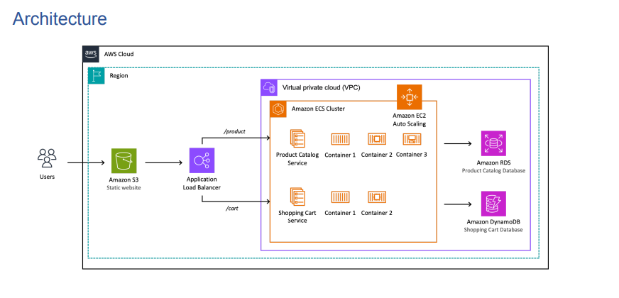

# 🐳 Containerized Microservices on AWS ECS Fargate

A production-ready microservices setup deployed on **AWS ECS Fargate**, fronted by an **Application Load Balancer (ALB)**, and containerized with **Docker**.  
The project demonstrates how to host multiple Flask-based microservices (User & Product) behind a single load balancer.

---

## 🏗️ Architecture Overview



### Components
- **User Service** – Flask app running on port `5000`
- **Product Service** – Flask app running on port `5001`
- **Application Load Balancer** – Routes:
  - `/users*` → `tg-users`
  - `/products*` → `tg-products`
- **AWS ECS Fargate** – Serverless container compute service
- **Amazon CloudWatch** – Logs & metrics for containers

---

## 🧰 Tech Stack

| Tool | Purpose |
|------|----------|
| **AWS ECS Fargate** | Container orchestration |
| **AWS ALB** | Routing to target groups |
| **Docker** | Containerization |
| **Flask** | Python microservice framework |
| **CloudWatch** | Monitoring & logging |

---

## ⚙️ Setup Instructions

### 1️⃣ Clone this repository
```bash
git clone https://github.com/ManvendraSinghShekhawat/containerized-microservices.git
cd containerized-microservices


## 🚀 **Deployment Guide (Manual AWS Setup)**

Follow these steps to deploy your containerized microservices on **AWS ECS Fargate** behind an **Application Load Balancer (ALB)**.

---

### 🛰️ **Step 1 — Create ECS Cluster**

- Navigate to **ECS Console → Clusters → Create Cluster**
- Choose **Launch Type:** `Fargate`
- Set **Cluster Name:** `microservices-cluster`
- Click **Create**

---

### 🎯 **Step 2 — Create Target Groups**

Create two target groups for your services.

| Target Group | Target Type | Port | Health Check Path |
|---------------|--------------|------|-------------------|
| `tg-users` | IP | 5000 | `/health` |
| `tg-products` | IP | 5001 | `/health` |

💡 *Tip:* Use the same VPC as your ECS cluster. Keep the protocol as **HTTP** and target type as **IP** for Fargate.

---

### 🌐 **Step 3 — Create Application Load Balancer (ALB)**

- Go to **EC2 → Load Balancers → Create Load Balancer → Application Load Balancer**
- **Scheme:** Internet-facing  
- **Protocol:** HTTP (Port 80)  
- **Availability Zones:** Select at least 2 subnets in your default VPC  
- **Security Group:** Allow inbound port **80 (HTTP)** from `0.0.0.0/0`  
- **Default Target Group:** `tg-users`

Once created:
1. Go to your ALB → **Listeners** tab  
2. Click **Edit rules**  
3. Add path-based routing rules:

| Path Pattern | Action |
|---------------|---------|
| `/users*` | Forward to `tg-users` |
| `/products*` | Forward to `tg-products` |

📘 *This ensures traffic to `/users` and `/products` is routed to their respective microservices.*

---

### 🧱 **Step 4 — Create ECS Services**

For each service, create an ECS Service linked to your ALB:

#### 🧩 User Service
- **Task Definition:** `user-service`
- **Launch Type:** `Fargate`
- **Cluster:** `microservices-cluster`
- **Load Balancer:** Select your ALB
- **Listener Port:** `80`
- **Target Group:** `tg-users`

#### 🧩 Product Service
- **Task Definition:** `product-service`
- **Launch Type:** `Fargate`
- **Cluster:** `microservices-cluster`
- **Load Balancer:** Select your ALB
- **Listener Port:** `80`
- **Target Group:** `tg-products`

---

### 🔍 **Step 5 — Verify Deployment**

After both services are running, go to your **ALB DNS name** in the AWS console and test:

```bash
http://<ALB-DNS>/users
http://<ALB-DNS>/products


👨‍💻 Author

Manvendra Singh Shekhawat
📧 manvendrasinghshekhawat324@gmail.com
